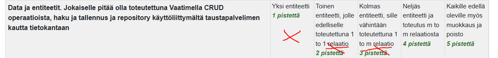

# Vaadinharjoitus
Tein Data ja Entiteetit osiosta 3 pisteeseen asti.

Entiteettejä on yhteensä 3. 
User entiteetillä on OneToOne relaatio PatientOverview entiteetin kanssa. Kun taas Measurement entiteetillä on ManyToOne relaatio User entiteetin kanssa.

